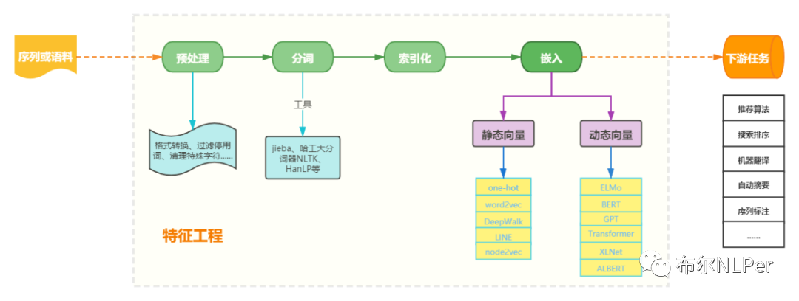

# 一起学习 Word Embedding

本章一起学习词嵌入，掌握词嵌入的相关概念，了解各个词嵌入，实现词嵌入算法

纸上得来终觉浅，绝知此事要躬行。 《[冬夜读书示子聿](https://www.gushiwen.cn/mingju/juv_bc2e9eb921c8.aspx)》

## 目录
- [文本向量化](#文本向量化)
- [词嵌入的种类](#词嵌入的种类)
  - [离散表示](#离散表示)
  - [分布式表示](#分布式表示)
- [其他资源](#其他资源)

## 文本向量化

文本向量化又称为 “词向量模型”、“向量空间模型”，即将文本表示成计算机可识别的实数向量， 根据粒度大小不同，可将文本特征表示分为字、词、句子、篇章几个层次
文本向量化方法一般称为词嵌入(word embedding)方法，词嵌入这个说法很形象，就是把文本中的词嵌入到文本空间中， 用一个向量来表示词

## 词嵌入的种类
### 离散表示
文本向量化离散表示是一种基于规则和统计的向量化方式，常用的方法包括 词集模型 和 词袋模型， 都是基于词之间保持独立性、没有关联为前提，将所有文本中单词形成一个字典，然后根据字典来统计单词出现频数

- [独热编码(One-hot Encoding)](./01.one-hot.ipynb)
- [词袋编码(Bag of Words)](./02.bag-of-word.ipynb)
- [TF-IDF编码](./03.tf-idf.ipynb)
- [N-GRAM编码](./04.n-gram.ipynb)

### 分布式表示
通过训练将每个词映射成 K 维实数向量(K 一般为模型中的超参数)， 通过词之间的距离(如，consine 相似度、欧氏距离)来判断它们之间的语义相似度。

离散表示虽然能够进行词语或者文本的向量表示，进而用模型进行情感分析或者是文本分类之类的任务。 但其不能表示词语间的相似程度或者词语间的类比关系。

>比如：queen 和 king 两个词语，它们表达相近的意思，所以希望它们在整个文本的表示空间内挨得很近。
一般认为，词向量、文本向量之间的夹角越小，两个词相似度越高，词向量、文本向量之间夹角的关系用下面的余弦夹角进行表示:

$\cos\theta = \frac{\vec{A} \cdot \vec{B}}{|\vec{A}| \cdot |\vec{B}|}$

离散表示，如 One-Hot 表示无法表示上面的余弦关系，引入分布式表示方法，其主要思想是 用周围的词表示该词.

- [Word2Vec](./05.word2vec.ipynb)
- [GloVe](./06.glove.ipynb)
- [FastText](./07.fasttext.ipynb)
- [ELMo](./08.elmo.ipynb)
- [BERT](./09.bert.ipynb)

## 其他资源
- [NLP–文本向量化](https://deeplearning-doc.readthedocs.io/en/latest/deeplearning/NLP/NLP-text-vector.html#co-currence-matrix)
- [AI文本处理的突破：从One-Hot到Embedding模型](https://www.53ai.com/news/qianyanjishu/2024060576385.html)
- [词表示](https://paddlepedia.readthedocs.io/en/latest/tutorials/sequence_model/word_representation/index.html)
- [word embedding](https://github.com/shibing624/nlp-tutorial/blob/main/01_word_embedding/01_%E6%96%87%E6%9C%AC%E8%A1%A8%E7%A4%BA.ipynb)

