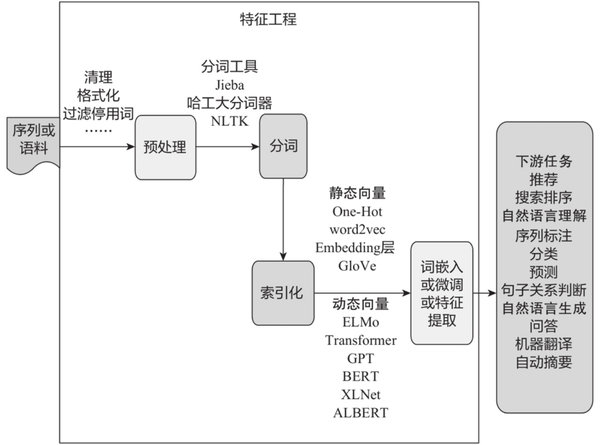
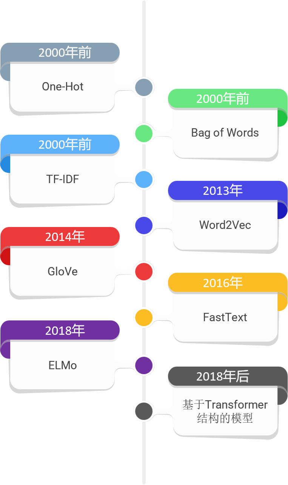
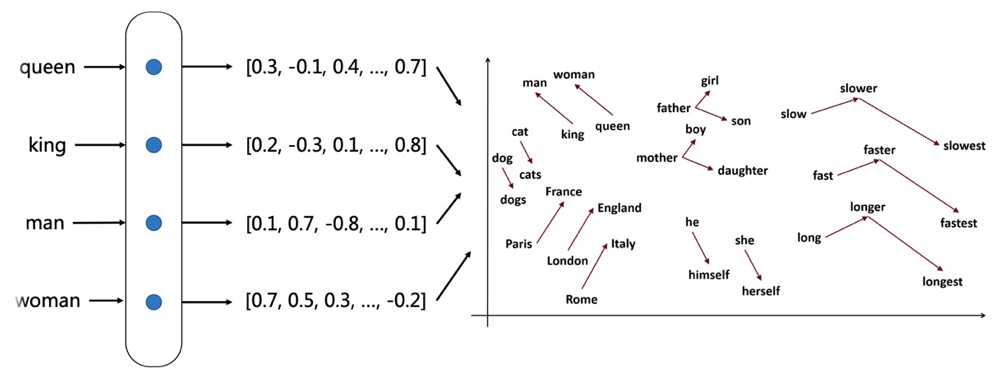

# 一起学习 Word Vector

本章一起学习文本向量化，掌握文本向量的相关概念，了解各个文本向量，实现文本向量的算法

 

<!-- 这里是一个空白行 -->

  纸上得来终觉浅，绝知此事要躬行。 
  <small><a href="https://www.gushiwen.cn/mingju/juv_bc2e9eb921c8.aspx">《冬夜读书示子聿》</a></small>

## 目录
- [文本向量化](#文本向量化)
- [词嵌入的种类](#词嵌入的种类)
  - [离散表示](#离散表示)
  - [分布式表示](#分布式表示)
- [结语](#结语)
- [其他资源](#其他资源)

## 文本向量化

文本向量化又称为 “词向量模型”、“向量空间模型”，即将文本表示成计算机可识别的实数向量， 根据粒度大小不同，可将文本特征表示分为字、词、句子、篇章几个层次

文本向量化方法一般称为词嵌入(word embedding)方法，词嵌入这个说法很形象，就是把文本中的词嵌入到文本空间中， 用一个向量来表示词（将各个单词表示为预定义向量空间中的实值向量）

[//]: # (![Image]&#40;images/img_1.png "Image"&#41;)
 

## 词嵌入的种类
### 离散表示
文本向量化离散表示是一种基于规则和统计的向量化方式，常用的方法包括 词集模型 和 词袋模型， 都是基于词之间保持独立性、没有关联为前提，将所有文本中单词形成一个字典，然后根据字典来统计单词出现频数

- [独热编码(One-hot Encoding)](./01.one-hot.ipynb)
- [词袋编码(Bag of Words)](./02.bag-of-word.ipynb)
- [TF-IDF编码](./03.tf-idf.ipynb)
- [N-GRAM编码](./04.n-gram.ipynb)

**离散表示的缺点**：

- 无法衡量词向量之间的关系。
- 词表的维度随着语料库的增长而膨胀。
- n-gram词序列随语料库增长呈指数型膨胀，更加快。
- 离散数据来表示文本会带来数据稀疏问题，导致丢失了信息，与我们生活中理解的信息是不一样的。
> 离散表示虽然能够进行词语或者文本的向量表示，进而用模型进行情感分析或者是文本分类之类的任务。 但其不能表示词语间的相似程度或者词语间的类比关系。

### 分布式表示
通过训练将每个词映射成 K 维实数向量(K 一般为模型中的超参数)， 通过词之间的距离(如，consine 相似度、欧氏距离) 来判断它们之间的语义相似度。

>比如：queen 和 king 两个词语，它们表达相近的意思，所以希望它们在整个文本的表示空间内挨得很近。
一般认为，词向量、文本向量之间的夹角越小，两个词相似度越高，词向量、文本向量之间夹角的关系用下面的余弦夹角进行表示:

$\cos\theta = \frac{\vec{A} \cdot \vec{B}}{|\vec{A}| \cdot |\vec{B}|}$

离散表示，如 One-Hot 表示无法表示上面的余弦关系，引入分布式表示方法，其主要思想是 用周围的词表示该词.
> **用一个词附近的其它词来表示该词，这是现代统计自然语言处理中最有创见的想法之一。** 当初科学家发明这种方法是基于人的语言表达，认为一个词是由这个词的周边词汇一起来构成精确的语义信息。就好比，物以类聚人以群分，如果你想了解一个人，可以通过他周围的人进行了解，因为周围人都有一些共同点才能聚集起来。

- [Word2Vec](./05.word2vec.ipynb)
- [GloVe](./06.glove.ipynb)
- [FastText](./07.fasttext.ipynb)
- [ELMo](./08.elmo.ipynb)
- [BERT](./09.bert.ipynb)

在学习文本向量之前，先了解**共现矩阵与NNLM**

**共现矩阵**

> 共现矩阵顾名思义就是共同出现的意思，词文档的共现矩阵主要用于发现主题(topic)，用于主题模型，如LSA。
> 
> 局域窗中的word-word共现矩阵可以挖掘语法和语义信息，例如：
> - I like deep learning.
> - I like NLP.
> - I enjoy flying
> 
> 有以上三句话，设置滑窗为2，可以得到一个词典：\
> `{"I like","like deep","deep learning","like NLP","I enjoy","enjoy flying","I like"}`
> 
> 我们可以得到一个共现矩阵(对称矩阵)：
> 
> 
> 中间的每个格子表示的是行和列组成的词组在词典中共同出现的次数，也就体现了共现的特性。
> 
> 存在的问题：
> - 向量维数随着词典大小线性增长。
> - 存储整个词典的空间消耗非常大。
> - 一些模型如文本分类模型会面临稀疏性问题。
> - 模型会欠稳定，每新增一份语料进来，稳定性就会变化。

**NNLM**

> NNLM (Neural Network Language model)，神经网络语言模型是03年提出来的，通过训练得到中间产物--词向量矩阵，这就是我们要得到的文本表示向量矩阵。
> 
> NNLM说的是定义一个前向窗口大小，其实和上面提到的窗口是一个意思。把这个窗口中最后一个词当做y，把之前的词当做输入x，通俗来说就是预测这个窗口中最后一个词出现概率的模型。
> 
> 
> NNLM的网络结构图
> 
> 
> - input层是一个前向词的输入，是经过one-hot编码的词向量表示形式，具有V*1的矩阵。
> 
> - C矩阵是投影矩阵，也就是稠密词向量表示，在神经网络中是w参数矩阵，该矩阵的大小为D*V，正好与input层进行全连接(相乘)得到D*1的矩阵，采用线性映射将one-hot表示投影到稠密D维表示。
>   
> - output层(softmax)自然是前向窗中需要预测的词。
> 
> - 通过BP＋SGD得到最优的C投影矩阵，这就是NNLM的中间产物，也是我们所求的文本表示矩阵，通过NNLM将稀疏矩阵投影到稠密向量矩阵中。
>

## 结语
在大模型时代，embedding成为一项必不可少的技术，主要是因为它能够有效地将大量高维数据（如文本、图像和音频信息）转换成更低维的、密集的向量表示。这种表示可以捕捉到数据的本质特征，并且在处理和计算上更为高效。通过embedding，模型可以在这些压缩的向量空间中学习数据之间的复杂关系和模式，从而提高了处理速度和准确性。此外，embedding使得模型能够在较小的表示空间中进行操作，减少了计算资源的需求，同时也便于模型的训练和推理，这对于处理现代大规模数据集尤为关键。Embedding在大模型时代扮演着桥梁的角色，跨越了原始数据和机器学习算法之间的巨大鸿沟。

在自然语言处理领域，文本向量化技术的发展带来了革命性的变化。从最早的One-Hot编码到当前基于Transformer结构的embedding模型，每一次创新都带来了更高效、更精准的文本表示方式，为文本处理提供了更为灵活、高效的解决方案。未来，随着技术的不断进步和应用场景的不断拓展，文本向量化技术将继续发挥着重要的作用，并为人工智能在文本理解和处理领域带来更广阔的发展空间。

## 其他资源
- [词向量发展历程：技术及实战案例](https://mp.weixin.qq.com/s/nLfeTAlX7C1zfRC7JEPTaQ)
- [ML-NLP: word embedding✨](https://github.com/NLP-LOVE/ML-NLP/tree/master/NLP/16.1%20Word%20Embedding)
- [NLP–文本向量化](https://deeplearning-doc.readthedocs.io/en/latest/deeplearning/NLP/NLP-text-vector.html#co-currence-matrix)
- [AI文本处理的突破：从One-Hot到Embedding模型](https://www.53ai.com/news/qianyanjishu/2024060576385.html)
- [词表示](https://paddlepedia.readthedocs.io/en/latest/tutorials/sequence_model/word_representation/index.html)
- [NLP-Tutorial: word embedding✨](https://github.com/shibing624/nlp-tutorial/blob/main/01_word_embedding/01_%E6%96%87%E6%9C%AC%E8%A1%A8%E7%A4%BA.ipynb)
- [Chinese-word-embedding ✨](https://github.com/duanmuxiangyu/Chinese-word-embedding)
- [Word Embedding using GloVe | Feature Extraction | NLP | Python](https://www.hackersrealm.net/post/word-embedding-using-glove-python)
  - [CODE ✨](https://github.com/aswintechguy/Data-Science-Concepts/blob/main/NLP/Natural%20Language%20Processing(NLP)%20Concepts%20-%20Hackers%20Realm.ipynb) 

